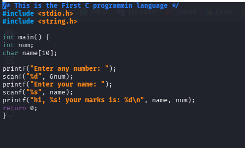
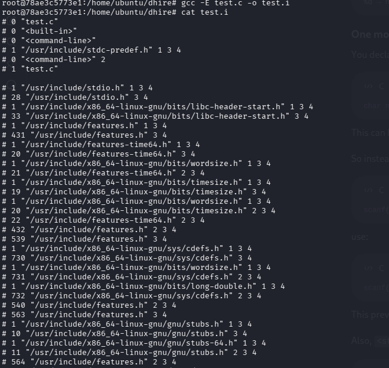
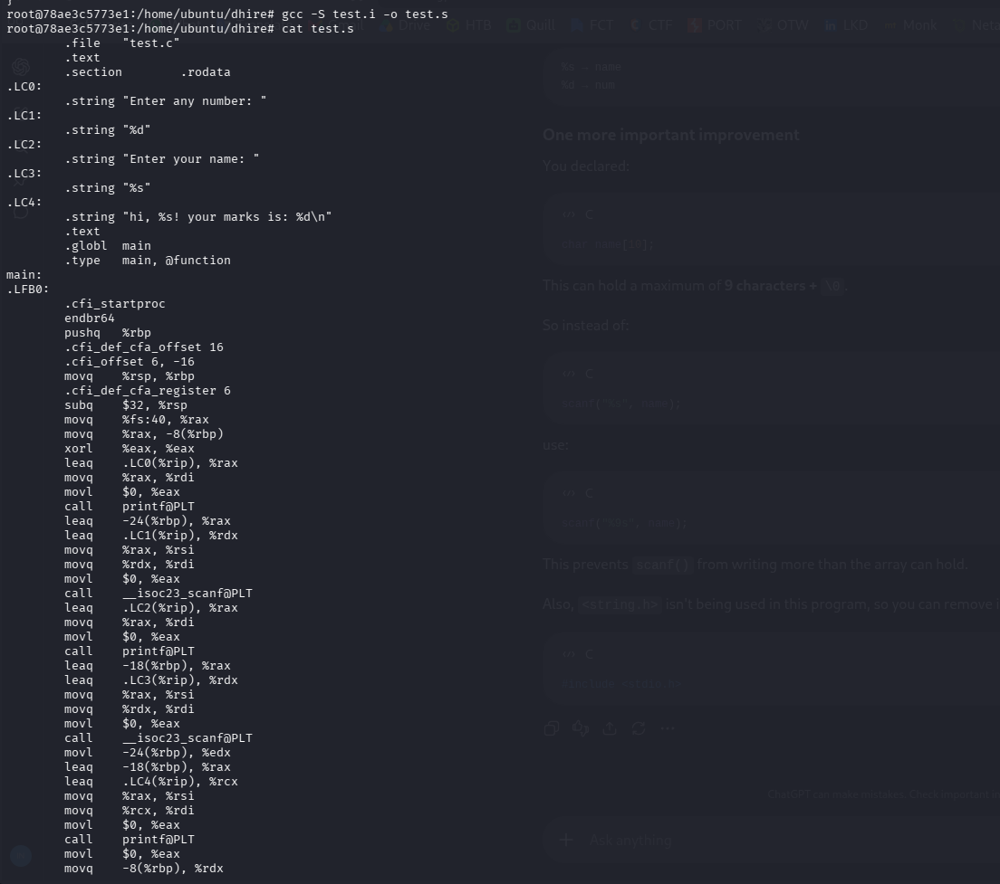
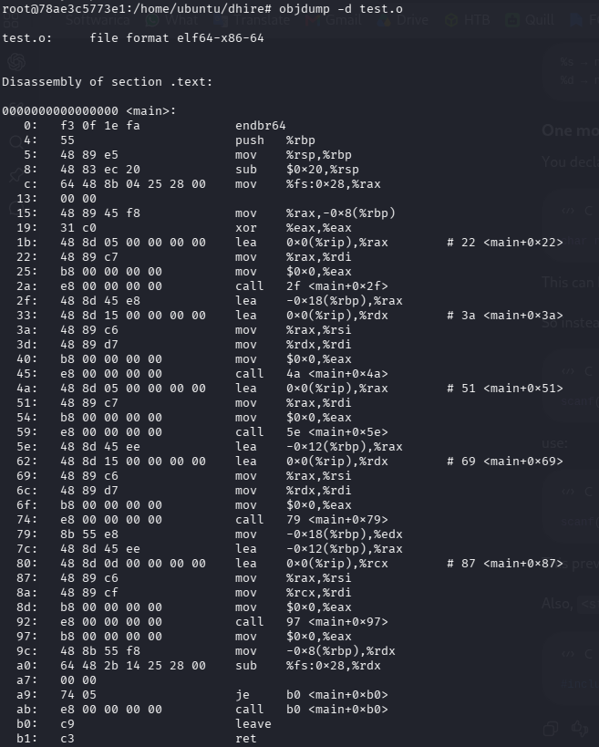
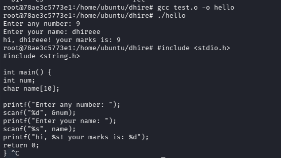

<h1>C Compilation Flow</h1><hr>

<h3>Source code of C</h3><br>
<p>This file contains the source code which are shown below. after that, now i explains that how to C programming compile their code means run code through compiler to check errors. Compiler creates an executable file which contains 0s and 1s and then result can be seen.</p>
<div align="center">



**Figure 1: source code**

</div>
<h3>Procedure of compilation</h3>
<p>For the C program, we use GCC (GNU Compiler collection) which is used to compile c programs into executable programs. The process by process explains belows.</p>
<h3>Stage 1: Preprocessing</h3>
<p>The preprocessing stage is the first step in C compilation. It prepares the source code before actual compilation. It process header files using <b>#include</b>,other one are replaces macros using <b>#define</b>. The another one are handles conditional statements like <b>#ifdef</b> and last removs comments. The preprocessed code is usually saved as a <b>.i</b> file.</p>

```bash
gcc -E test.c -o test.i
```

<div align="center">
 </div>

<h3>Stage 2: Compile</h3>
<p>During the compilation stage, the preprocessed C code is converted into assembly code. The compiler checks the program for syntax and other errors, analyzes the code, and optimizes it when possible. The resulting assembly code is stored in a <b>.s</b> file, which is then passed to the assembler.</p>

```bash
gcc -S test.i -o test.s
```

<div align="center">


</div>

<h3>Stage 3: Assembly</h3>
<p>During the assembly stage, the assembly code produced by the compiler is converted into machine code. The assembler creates an object file (.o) containing machine instructions, symbols, and other information needed for linking. This object file is not yet a complete executable program.</p>

```bash
gcc -c test.s -o test.o

# this file cannot read by using cat cmd, by reading this use
objdump -d test.o
```

<div align="center">


</div>


<h3>Stage 4: Linking</h3>
<p>During the linking stage, the linker combines the object file with required libraries and other object files. It connects functions and variables used by the program, such as <b>printf()</b>, with their actual definitions. Finally, it creates the executable file, which the operating system can run.</p>

```bash
gcc test.o -o test
```
<div align="center">


</div>


<h3>Conclusion</h3>
<p>
Understanding the C compilation flow helps us know how a C program becomes an executable file. The process goes through four main stages: **preprocessing, compilation, assembly, and linking**. Each stage performs a specific task and prepares the program for the next stage. This makes it easier to understand how GCC works and troubleshoot compilation errors.</p>

